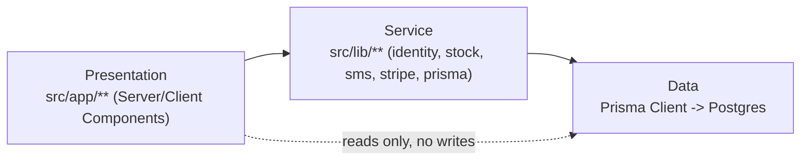
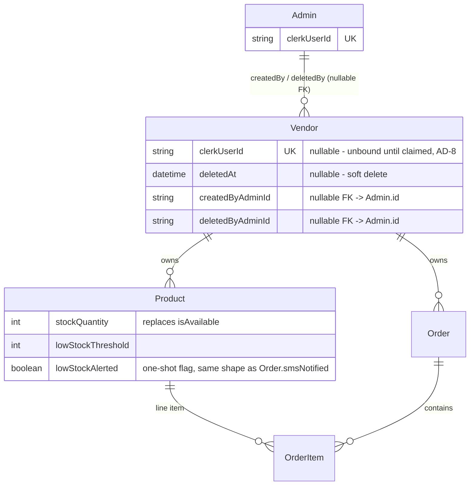

# Architecture Spine — local-food — Admin & Inventory Expansion

## Design Paradigm

Layered, server-first — the existing app's shape, ratified not changed:

- **Presentation** (`src/app/**`) — Server Components fetch directly (`await prisma.*` in the component body); `"use client"` only where state/effects are needed.
- **Service** (`src/lib/**`) — one file per concern (external integration or cross-cutting operation). This spine adds to it, doesn't restructure it.
- **Data** (Prisma Client → Postgres) — the only persistence path; no service bypasses Prisma.

Dependency direction is one-way: Presentation → Service → Data. A Server Component may call a `src/lib` function or Prisma directly for reads; it may **not** duplicate logic a `src/lib` function already owns (identity resolution, stock mutation) — see AD-3, AD-4, AD-6.



## Invariants & Rules

### AD-1 — Admin identity is a new `Admin` table, keyed by `clerkUserId`

- **Binds:** FR-2, FR-3, FR-4, FR-9, FR-10
- **Prevents:** Admin-ness being resolved two different ways (a DB lookup in one code path, a Clerk session claim in another) as independent admin routes get built.
- **Rule:** `Admin.clerkUserId` (unique) is the sole source of admin identity, mirroring `Vendor.clerkUserId`'s existing shape. Every admin-gated Server Component/route resolves it through `getCurrentAdmin()` (AD-6) — never an inline Clerk claim check.

### AD-2 — `isAvailable` is derived, never stored — and checkout validates sufficiency, not just availability

- **Binds:** FR-6, FR-7, FR-12, and every existing query/read that touches product availability (checkout route, storefront listings, `src/app/dashboard/products/page.tsx`)
- **Prevents:** `isAvailable` and `stockQuantity` drifting out of sync through a missed write path; a builder re-adding a differently-named cached/derived boolean that reintroduces the same drift under a new name; checkout accepting an order for more units than are actually in stock (a `stockQuantity > 0` display check is not a sufficiency check).
- **Rule:** The `Product.isAvailable` column is dropped, and no persisted boolean or cached field may re-derive availability under any name — it is computed at read time only. For **display** (storefront listing/detail, `src/app/dashboard/products/page.tsx:40`), availability is `stockQuantity > 0`. For **checkout** (`src/app/api/checkout/route.ts`), the existing `where: { isAvailable: true }` filter is replaced with a per-line check that `stockQuantity >= requestedQuantity` for every item — not merely `> 0` — rejecting the whole order if any line is short. Migration ordering: `stockQuantity` (FR-12) is backfilled and populated for every existing Product *before* the `isAvailable` column is dropped, so no window exists where availability is undefined.

### AD-3 — Stock Quantity has exactly one write path; the low-stock flag is set only after the SMS actually sends

- **Binds:** FR-7, FR-8, FR-10, FR-11, FR-12, any future manual stock adjustment
- **Prevents:** Two independently-built call sites (e.g. the sale-decrement webhook and a future admin stock-edit form) racing on the last unit; a multi-item order partially decrementing when one line runs short; `lowStockAlerted` being marked true before the alert actually delivered (the same failure mode FR-10 explicitly calls out for `smsNotified`).
- **Rule:** All writes to `Product.stockQuantity` go through one server-only function, `adjustStock()` (in `src/lib/inventory.ts` or equivalent). It performs a conditional update (`UPDATE ... WHERE stockQuantity >= :delta`, checking rows-affected) — never a bare `prisma.product.update({ stockQuantity })` from a route handler or Server Action. For a multi-item order, every line's decrement runs inside one DB transaction — all succeed or none do. A post-payment shortfall (money already captured, stock insufficient — should be rare since checkout already validated sufficiency per AD-2, but not impossible under a race) is not auto-resolved: `adjustStock()` returns a shortfall result and the order is flagged for manual admin review, not silently over-decremented or auto-refunded (auto-refund is out of scope — see Deferred). `lowStockAlerted` is a **separate** write from the stock decrement: `adjustStock()` returns whether the threshold was newly crossed, the caller then calls `sendSms()`, and only a *successful* send sets `lowStockAlerted = true` — same order of operations as the existing `smsNotified` pattern (never mark delivered before it's sent).
- On the client, `CartItem` carries the `stockQuantity` known at add-to-cart time so FR-11's stepper can show a sensible ceiling — this is a UX hint only, may go stale, and is never authoritative; checkout's per-line sufficiency check (AD-2) is the sole enforcement point regardless of what the client allowed.

### AD-4 — Vendor-deactivated is checked through one shared guard, with one contract

- **Binds:** FR-4, storefront route, checkout API, any future vendor-scoped route
- **Prevents:** Routes disagreeing on what "deactivated" means (e.g. one checks `deletedAt != null`, another checks a different flag); routes disagreeing on how the check reports its result, so one route's error handling silently drifts from another's.
- **Rule:** `assertVendorActive(vendor: Vendor): void` (in `src/lib/vendor.ts`, alongside the existing `getCurrentVendor()`) is the sole check — it **throws** a typed `VendorDeactivatedError` when `deletedAt != null`, never returns a boolean. Storefront route catches it and renders the "no longer available" message (FR-4); checkout API catches it and returns the existing 4xx error-JSON shape used elsewhere in that route. Neither route re-implements the `deletedAt` condition inline.

### AD-5 — Admin actions are attributed via a plain field, not an audit log

- **Binds:** FR-2
- **Prevents:** Over-building a generic audit-log system nothing else in the app needs yet; two builders picking different FK targets for "which admin."
- **Rule:** Attribution is a nullable FK column at the point of action, referencing `Admin.id` (not `Admin.clerkUserId`) — e.g. `Vendor.deletedByAdminId`, `Vendor.createdByAdminId` — not a separate log table.

### AD-6 — Admin pages live under `/admin/*`, gated by `getCurrentAdmin()`

- **Binds:** FR-2, FR-3, FR-4, FR-9, FR-10
- **Prevents:** An admin route shipping unprotected, or re-implementing the admin check ad hoc per route.
- **Rule:** Admin UI is a new route tree, `src/app/admin/**`, separate from vendor's `src/app/dashboard/**` (different identity, cross-vendor data scope). Every new admin route is added to `middleware.ts`'s `isProtectedRoute` matcher (inherited project rule — middleware proves *authenticated*, nothing more) and additionally calls `getCurrentAdmin()` (mirrors `getCurrentVendor()`'s existing shape) at the top of the Server Component or route handler to prove *admin*.

### AD-7 — Vendor slug collisions are checked through one function, admin-create path only

- **Binds:** FR-3
- **Prevents:** The admin-create-vendor path and any future vendor-facing path each rolling their own slug-uniqueness check with a different error shape.
- **Rule:** `resolveVendorSlug()` (in `src/lib/vendor.ts`) checks uniqueness and returns a friendly error before insert, replacing the raw Prisma constraint failure. Scope is the new admin-create path only (FR-3) — retrofitting this to any existing vendor self-registration flow is out of scope for this PRD (no such flow is affected by these FRs).

### AD-8 — Admin-created Vendors start unbound; login binding is manual, out-of-band

- **Binds:** FR-3
- **Prevents:** Two builders each guessing a different mechanism (a made-up invite token, a temporary password, an auto-generated Clerk account) for a flow the PRD never actually specified.
- **Rule:** `Vendor.clerkUserId` becomes nullable (was required+unique). An admin-created Vendor has `clerkUserId: null` until someone (admin/ops) manually sets it once the vendor signs up with Clerk separately — no invite/claim flow is built. Every existing query assuming `clerkUserId` is always present (`getCurrentVendor()` and any vendor-facing route) must handle the null case as "not yet claimed," not crash.

### AD-9 — The migration placeholder is one named constant, shared by the migration and the vendor-facing flag

- **Binds:** FR-12, FR-13
- **Prevents:** The backfill migration and the dashboard banner check (FR-13) each hardcoding `100` independently, so a future change to the placeholder value silently desyncs them.
- **Rule:** `PLACEHOLDER_STOCK_QUANTITY = 100` is defined once (e.g. `src/lib/inventory.ts`) and imported by both the migration script and the `/dashboard/products` banner condition (`stockQuantity === PLACEHOLDER_STOCK_QUANTITY`) — neither hardcodes the literal.

## Consistency Conventions

| Concern | Convention |
| --- | --- |
| Naming (entities, files, interfaces, events) | `Admin` model; `adjustStock()`, `assertVendorActive()`, `getCurrentAdmin()`, `PLACEHOLDER_STOCK_QUANTITY` in `src/lib/`; admin routes under `src/app/admin/**` |
| Data & formats (ids, dates, error shapes, envelopes) | `stockQuantity: Int`, non-negative (enforced by AD-3's conditional update, never by app-level validation alone); `lowStockThreshold: Int`, per-product; existing `cuid()` ids, cents-based money unchanged |
| State & cross-cutting (mutation, errors, logging, config, auth) | All stock writes via `adjustStock()` (AD-3); all vendor-active checks via `assertVendorActive()` (AD-4); admin auth = middleware (authenticated) + `getCurrentAdmin()` (is-admin), never one without the other |

## Structural Seed



`Vendor → Product` and `Vendor → Order` both drop their current `onDelete: Cascade` (`prisma/schema.prisma:46`, `:82`) — required by AD-4's soft-delete: a real cascade would delete Products still referenced by existing `OrderItem`s and break fulfillment of in-flight Orders.

```text
src/app/
  admin/              # NEW - Admin route tree (AD-6), gated by getCurrentAdmin()
    vendors/           # FR-3, FR-4 - add/deactivate vendor
    inventory/          # FR-9 - cross-vendor Inventory Report page
  dashboard/           # EXISTING - vendor self-service, unchanged shape
  cart/                # EXISTING - FR-1 (verify), FR-11 (new stepper)
  api/
    checkout/          # EXISTING - extend: stockQuantity check (FR-7), assertVendorActive() (AD-4)
    webhooks/          # EXISTING - extend: adjustStock() call on payment confirmation (FR-8, AD-3)
src/lib/
  vendor.ts            # EXISTING - add assertVendorActive() (AD-4)
  admin.ts             # NEW - getCurrentAdmin() (AD-1, AD-6)
  inventory.ts         # NEW - adjustStock() (AD-3)
```

## Capability → Architecture Map

| Capability / Area | Lives in | Governed by |
| --- | --- | --- |
| FR-1 (cart remove) | `src/components/CartProvider.tsx`, `src/app/cart/` | Paradigm (client-side state, unchanged) |
| FR-11 (cart quantity stepper) | `src/components/CartProvider.tsx`, `src/app/cart/` | AD-2 (checkout is sole enforcement), AD-3 (client ceiling is a UX hint only) |
| FR-2 (admin gating) | `src/lib/admin.ts`, `middleware.ts` | AD-1, AD-6 |
| FR-3, FR-4 (vendor add/deactivate) | `src/app/admin/vendors/`, `src/lib/vendor.ts` | AD-1, AD-4, AD-5, AD-6, AD-7, AD-8 |
| FR-6, FR-7 (out-of-stock UI + cart block) | storefront listing/detail pages, `src/app/api/checkout/route.ts` | AD-2 |
| FR-8 (post-sale decrement) | `src/app/api/webhooks/`, `src/lib/inventory.ts` | AD-3 |
| FR-9 (Inventory Report page) | `src/app/admin/inventory/` | AD-1, AD-6 |
| FR-10 (low-stock SMS) | `src/lib/inventory.ts`, `src/lib/sms/` | AD-3 |
| FR-12 (Stock Quantity creation input + backfill) | `AddProductForm`, Prisma migration | AD-2, AD-9 |
| FR-13 (vendor placeholder-count notification) | `src/app/dashboard/products/page.tsx` | AD-9 |

## Deferred

- **Vendor invite/claim flow** (AD-8) — automating the clerkUserId binding for an admin-created vendor (invite link, email, self-claim) is a real feature beyond FR-3's literal scope; manual/out-of-band binding is the v1 answer.
- **Auto-refund on a post-payment stock shortfall** (AD-3) — the rare race where checkout validated sufficiency but a concurrent order still exhausted stock before this order's webhook landed. Flagged for manual admin review, not automated; auto-refund logic is out of scope for this PRD.
- **Multiple admin permission tiers** — PRD Non-Goal; single flat `Admin` role is sufficient until a real second tier is requested.
- **Deployment/environment topology** — unchanged by this work; no new env vars, no new external service, Vercel assumption from `project-context.md` stands as-is.
- **Clerk-claim-based admin identity** — considered (AD-1), rejected for this altitude; revisit only if the `Admin` table approach proves to be the wrong call in practice.
